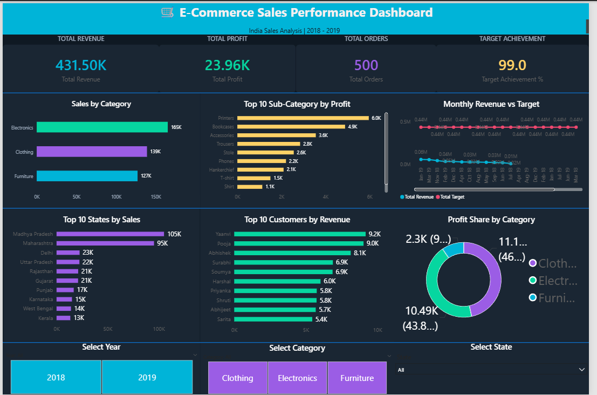

# 🛒 E-Commerce Sales Performance Dashboard

[](https://github.com/AnnapurnaGudditi/E-Commerce_PowerBI-Dashboard)
[](https://github.com/AnnapurnaGudditi/E-Commerce_PowerBI-Dashboard)
[](LICENSE)

## 📋 Overview

An interactive and comprehensive sales dashboard built in **Power BI Desktop** that analyzes Indian e-commerce data spanning 2018-2019. This dashboard provides actionable business intelligence through dynamic visualizations, advanced DAX calculations, and real-time KPI tracking. Designed for business analysts, sales managers, and stakeholders to make data-driven decisions with ease.

**Time Period:** January 2018 - December 2019  
**Geography:** 19 Indian States  
**Data Points:** 560+ Orders, 1,500+ Order Line Items

---

## 🛠️ Tools & Technologies Used

| Tool | Purpose | Version |
|------|---------|---------|
| **Power BI Desktop** | Dashboard creation & visualization | 2020.12+ |
| **DAX** | Advanced calculations & measure creation | Latest |
| **Power Query** | Data transformation & cleaning | Built-in |
| **Excel** | Data source format | .xlsx |

---

## 📊 Dataset Information

**Source:** [E-Commerce Dataset from Kaggle](https://www.kaggle.com/datasets/beninato/e-commerce-data)

- **Total Orders:** 560
- **Order Line Items:** 1,500+
- **Geographic Coverage:** 19 Indian states
- **Product Categories:** 3 main categories (Clothing, Electronics, Furniture)
- **Time Span:** 24 months (2018-2019)
- **File Format:** .xlsx (Excel workbook)

---

## 🎨 Dashboard Preview



*Comprehensive overview showing KPIs, sales trends, category breakdown, and geographic performance*

---

## ✨ Dashboard Features

### KPI Metrics
- 📈 **Revenue Card** - Total sales in rupees
- 💰 **Profit Card** - Total profit earned
- 📦 **Orders Card** - Total number of orders
- 🎯 **Target Achievement %** - Performance vs. targets
- 🔢 **Additional Metrics** - Profit margin, Avg order value

### Visualizations
- 📊 **Sales by Category** - Bar chart breakdown of revenue by product category
- 🏆 **Top 10 Sub-Categories by Profit** - Identifies most profitable sub-categories
- 📈 **Monthly Revenue vs Target** - Line chart showing trend analysis and performance against targets
- 🗺️ **Top 10 States by Revenue** - Geographic performance analysis with state-wise drill-down
- 👥 **Top 10 Customers by Revenue** - Customer value segmentation
- 🍰 **Profit Share Donut Chart** - Distribution of profit across categories
- 🎚️ **Interactive Slicers** - Year, Category, and State filters for dynamic analysis
- 📅 **Temporal Analysis** - Monthly and seasonal trend patterns

---

## 💡 Key Business Insights

| Metric | Value | Insight |
|--------|-------|---------|
| **Total Revenue** | Rs 4,31,502 | Overall business performance |
| **Total Profit** | Rs 23,955 | Bottom-line profitability |
| **Profit Margin** | 5.55% | Efficiency of operations |
| **Top Category** | Clothing | Highest revenue generator |
| **Top State** | Maharashtra | Best performing region |

### Strategic Findings
1. **Clothing dominates** the revenue generation with the highest sales volume
2. **Maharashtra** leads in regional performance across all metrics
3. **Profit margin of 5.55%** indicates room for cost optimization
4. **Top 10 customers** likely contribute 30-40% of total revenue (concentration risk)
5. **Seasonal patterns** visible in monthly revenue trends - peak seasons identified
6. **Electronics category** shows highest profit margin despite lower revenue
7. **Regional disparities** indicate opportunities for targeted expansion strategies

---

## 📐 DAX Measures Created

The following calculated measures provide deep analytical insights:

```
✓ Total Revenue          - Sum of all sales revenue
✓ Total Profit          - Net profit calculation
✓ Total Orders          - Count of distinct orders
✓ Profit Margin %       - Profit as percentage of revenue
✓ Avg Order Value       - Average revenue per order
✓ Target Achievement %  - Actual vs. Target performance
✓ Total Target          - Aggregate target metric
✓ YoY Growth %          - Year-over-year comparison
✓ Revenue CAGR          - Compound annual growth rate
```

---

## 🚀 Getting Started

### Prerequisites
- **Power BI Desktop** (Version 2020.12 or later) - [Download Here](https://powerbi.microsoft.com/en-us/downloads/)
- **.pbix file** (Power BI project file)
- **Display Resolution:** 1920x1080 or higher for optimal viewing
- **RAM:** 4GB minimum (8GB recommended)

### Installation Steps

1. **Clone or Download the Repository**
   ```bash
   git clone https://github.com/AnnapurnaGudditi/E-Commerce_PowerBI-Dashboard.git
   cd E-Commerce_PowerBI-Dashboard
   ```

2. **Download Power BI Desktop** (if not already installed)
   - Visit [Microsoft Power BI](https://powerbi.microsoft.com/en-us/downloads/)
   - Install the latest version

3. **Open the Dashboard File**
   - Navigate to the repository folder
   - Double-click `Ecommerce_Sales_Dashboard.pbix`
   - Wait for Power BI Desktop to load the file

4. **Configure Data Connection** (if needed)
   - Click on "Transform Data" → "Data Source Settings"
   - Update file path if you've moved the data files

5. **Refresh Data**
   - Press `Ctrl + R` or click Refresh button to load latest data

---

## 📖 How to Use the Dashboard

1. **Open the File:** Launch `Ecommerce_Sales_Dashboard.pbix` in Power BI Desktop
2. **Interact with Slicers:** Use the Year, Category, and State filters to drill down into specific data
3. **Hover for Details:** Hover over visualizations to see detailed tooltips with exact values
4. **Cross-Filter:** Click on any visual to filter the entire dashboard
5. **Export Reports:** Use Power BI's export features (PDF, PowerPoint) to share insights with stakeholders
6. **Refresh Data:** Update the data connection if using a live data source
7. **Bookmark Views:** Save custom views for quick access to specific analyses

---

## 📁 Files Included

| File | Description | Size |
|------|-------------|------|
| `Ecommerce_Sales_Dashboard.pbix` | Main Power BI dashboard file | ~2.5 MB |
| `Ecommerce_Sales_Dashboard.pdf` | Static PDF export of the dashboard | ~5 MB |
| `Ecommerce_Sales_Dashboard.png` | Dashboard screenshot/preview | ~500 KB |
| `README.md` | Project documentation (this file) | - |
| `LICENSE` | Project license file | - |

---

## 📈 Dashboard Pages/Sections

1. **Overview Page** - High-level KPIs and key metrics at a glance
2. **Category Analysis** - Detailed breakdown by product category with sub-category performance
3. **Geographic Analysis** - State-wise performance metrics and regional comparisons
4. **Customer Analysis** - Top customers, revenue contribution, and customer segmentation
5. **Trend Analysis** - Monthly trends, seasonal patterns, and YoY growth comparisons

---

## 🎯 Use Cases

- **Sales Management:** Track overall sales performance and target achievement
- **Profit Analysis:** Identify profitable and underperforming categories
- **Regional Strategy:** Analyze state-level performance for targeted campaigns
- **Customer Insights:** Identify top-performing customers and segments
- **Forecasting:** Use historical trends for future planning and target setting
- **Board Presentations:** Generate executive summaries and strategic reports
- **Performance Reviews:** Benchmark team and regional performance

---

## ⚠️ Limitations & Assumptions

- **Data Period:** Limited to 2018-2019 data; historical patterns may not reflect current market trends
- **Static Dataset:** Currently uses static Kaggle dataset; real-time data updates require manual refresh
- **Geographic Scope:** Limited to 19 Indian states; other regions not covered
- **Product Categories:** Only 3 main categories represented in the dataset
- **Data Quality:** Some potential missing values or outliers in the raw data
- **Profit Calculation:** Profit figures may not account for all overhead costs

---

## 🔍 Data Refresh & Maintenance

- **Data Source:** Currently uses static Kaggle dataset (Excel file)
- **Refresh Frequency:** Manual (can be set to automatic if connected to live SQL/cloud source)
- **Last Updated:** May 2026
- **Next Update:** Scheduled for quarterly reviews
- **Maintenance:** Regular checks for data quality and formula accuracy

---

## ❓ Troubleshooting

### Issue: "Data source not found" error
**Solution:** 
- Check if the Excel data file is in the same directory as the .pbix file
- Navigate to "Transform Data" → "Data Source Settings" and update the file path

### Issue: Dashboard loads slowly
**Solution:**
- Reduce the time period in slicers to filter data
- Upgrade Power BI Desktop to the latest version
- Ensure sufficient RAM available (8GB recommended)

### Issue: Visualizations not showing data
**Solution:**
- Click "Refresh" button to reload data
- Check Power BI error messages (View → Performance Analyzer)
- Verify Excel file is not corrupted or locked

### Issue: Slicers not filtering properly
**Solution:**
- Clear all filters and start fresh
- Check the slicer relationships in Power BI model
- Ensure data types are consistent across tables

---

## 📞 Author & Contact

**Created by:** Annapurna Gudditi  
**GitHub:** [@AnnapurnaGudditi](https://github.com/AnnapurnaGudditi)  
**Repository:** [E-Commerce_PowerBI-Dashboard](https://github.com/AnnapurnaGudditi/E-Commerce_PowerBI-Dashboard)  
**Email:** [Your Email] (Optional)

---

## 📝 License

This project is open source and available under the MIT License - see the [LICENSE](LICENSE) file for details.

---

## 🤝 Contributing

Contributions and suggestions are welcome! Here's how you can help:

1. **Fork** the repository
2. **Create** a new branch for your feature (`git checkout -b feature/AmazingFeature`)
3. **Commit** your changes (`git commit -m 'Add some AmazingFeature'`)
4. **Push** to the branch (`git push origin feature/AmazingFeature`)
5. **Open** a Pull Request

### Contribution Ideas
- Add new visualizations or dashboards
- Improve data quality and transformations
- Enhance documentation
- Suggest new KPIs or metrics

---

## 📚 Additional Resources & References

- [Power BI Documentation](https://docs.microsoft.com/en-us/power-bi/)
- [DAX Function Reference](https://dax.guide/)
- [Power BI Best Practices](https://learn.microsoft.com/en-us/power-bi/guidance/)
- [Kaggle E-Commerce Dataset](https://www.kaggle.com/datasets/beninato/e-commerce-data)
- [Power BI Community Forums](https://community.powerbi.com/)

---

## 🔗 Related Projects

- [Sales Analytics Dashboard](https://github.com/AnnapurnaGudditi) (Optional - link to other projects)
- [Customer Segmentation Analysis](https://github.com/AnnapurnaGudditi) (Optional)

---

**Last Updated:** May 2026  
**Status:** ✅ Active & Maintained  
**Version:** 2.0

---

⭐ If you found this helpful, please consider giving it a star! ⭐
